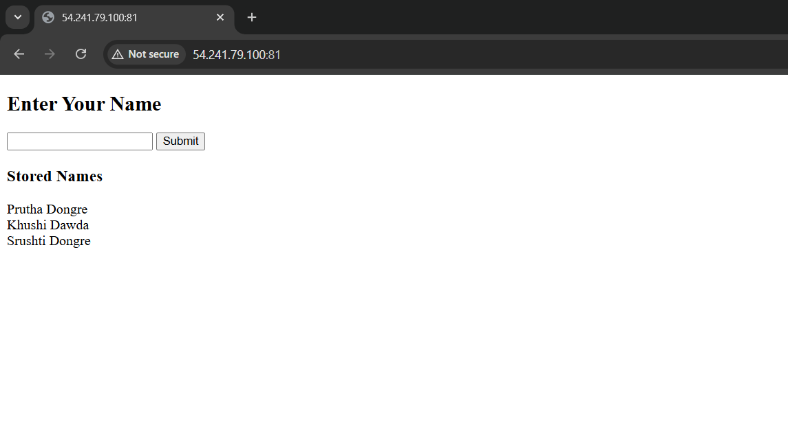
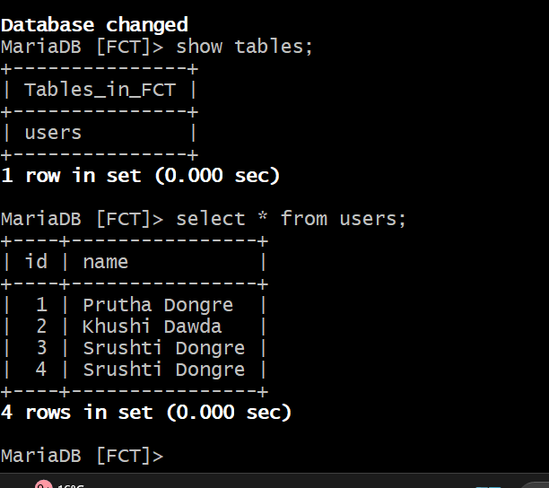

# 3-Tier PHP Application Deployment using Terraform & Ansible

This project demonstrates a real-world 3-Tier Architecture deployment on AWS, where:

- Terraform is used to provision complete cloud infrastructure

- Ansible is used for configuration management and application deployment

- A reverse proxy (Nginx) listens on port 81 instead of the default port 80

- Private subnets are secured using a NAT Gateway

- Ansible roles are used for clean, scalable configuration

- A remote S3 backend is used for Terraform state management

This project reflects an industry-style DevOps workflow, from infrastructure creation to application availability.

---

## ➤ Architecture Overview

The architecture follows a standard 3-tier design:

### 🔹 Proxy Layer (Public Subnet)

- Nginx reverse proxy

- Listens on port 81

- Exposes application to the internet

- Assigned a public IP

- Also used as Jump Server to access private servers securely via SSH

### 🔹 Application Layer (Private Subnet)

- Nginx + PHP + PHP-FPM

- Hosts a PHP web application

- Communicates with database internally

### 🔹 Database Layer (Private Subnet)

- MariaDB server

- Stores application data

- No public access

---

## ➤ Request Flow
```
User
  |
  |  http://<Proxy_Public_IP>:81
  |
Nginx Proxy (Public Subnet)
  |
Application Server (Private Subnet)
  |
MariaDB Server (Private Subnet)

```

---

## ➤ Technologies Used

- Cloud Provider: AWS

- Infrastructure as Code: Terraform

- Configuration Management: Ansible

- Web Server: Nginx

- Backend: PHP (php-fpm)

- Database: MariaDB

- OS: Amazon Linux

- State Backend: Amazon S3

---

## ➤ Project Structure

```
.
├── terraform/
│   ├── main.tf
│   ├── variables.tf
│   └── outputs.tf
│
├── ansible/
│   ├── inventory.ini
│   ├── playbook.yml
│   └── roles/
│       ├── proxy/
│       ├── app/
│       └── db/
│
├── images/
│   └── verification & architecture screenshots
│
└── README.md
```

---

## ➤ Infrastructure Provisioning (Terraform)

Terraform provisions the complete AWS infrastructure, including:

- Custom VPC (10.0.0.0/16)

- 1 Public Subnet

- 2 Private Subnets

- Internet Gateway

- NAT Gateway

- Route Tables and subnet association

- Security Groups

- EC2 Instances:

    - Proxy Server

    - Application Server

    - Database Server

- Remote Terraform backend using S3

### Terraform Remote Backend
```
terraform {
  backend "s3" {
    bucket = "bucket-name"
    key    = "terraform.tf"
    region = "us-west-1"
  }
}
```
### Terraform Commands
```
terraform init
terraform validate
terraform plan
terraform apply
```

---

### Security Group Rules

The security group allows only required traffic:

| Port | Purpose |
|------|--------|
| 22   | SSH |
| 81   | Public access to proxy |
| 80   | Internal HTTP |
| 3306 | MariaDB |


⚠️ Note:
The proxy server is intentionally configured to listen on port 81, and this port is explicitly allowed in the security group.


---

# ➤ Configuration Management (Ansible)
### Initial Implementation

- The project was first implemented using a single Ansible playbook to deploy all tiers.

### Final Implementation (Roles)

- To improve maintainability and scalability, the playbook was later refactored into Ansible roles:

## ➤ Proxy Role

- Installs Nginx

- Configures reverse proxy

- Listens on port 81

- Forwards traffic to application server

## ➤ App Role

- Installs Nginx, PHP, PHP-FPM

- Deploys PHP application

- Connects to MariaDB


## ➤ DB Role

- Installs MariaDB

- Creates database and user

- Enables remote DB access

- Uses PyMySQL for Ansible DB modules

# ➤ Ansible Execution
```
ansible-playbook -i inventory.ini playbook.yml
```

## ➤ Application Details

- Simple PHP application

- Accepts user input via form

- Stores data in MariaDB

- Displays stored records

- End-to-end connectivity verified

---

## ➤ Security Design Highlights

- Application and database servers are in private subnets

- No public IPs for private instances

- NAT Gateway used for outbound internet access

- After the infrastructure was provisioned, the private SSH key was copied to the proxy (bastion) server under /home/ec2-user/, enabling secure SSH access to the application and database servers

- SSH access via jump server pattern

- Key-based authentication and restricted security group rules are applied

---

## ➤ Terraform Outputs

After deployment, Terraform provides:

- Proxy server public IP

- Application server private IP

- Database server private IP

These outputs are reused in:

- Ansible inventory

- Proxy configuration

- Application-to-database connection

---

## ➤ Verification

- Application accessible via:
http://<Proxy_Public_IP>:81



- Data successfully inserted and retrieved from database


- Database access verified from private network

- Screenshots included in images/ directory

---
## ➤ Summary:
This project showcases a complete end-to-end implementation of a secure 3-Tier Architecture on AWS using Terraform and Ansible. Terraform is used to provision the entire infrastructure, including networking, compute resources, and security components, while Ansible handles configuration management through role-based automation. The application is exposed via an Nginx reverse proxy running on a non-default port (81), with the application and database layers securely isolated in private subnets. This project demonstrates practical DevOps skills such as Infrastructure as Code, configuration management, secure networking, and real-world deployment workflows.

---
